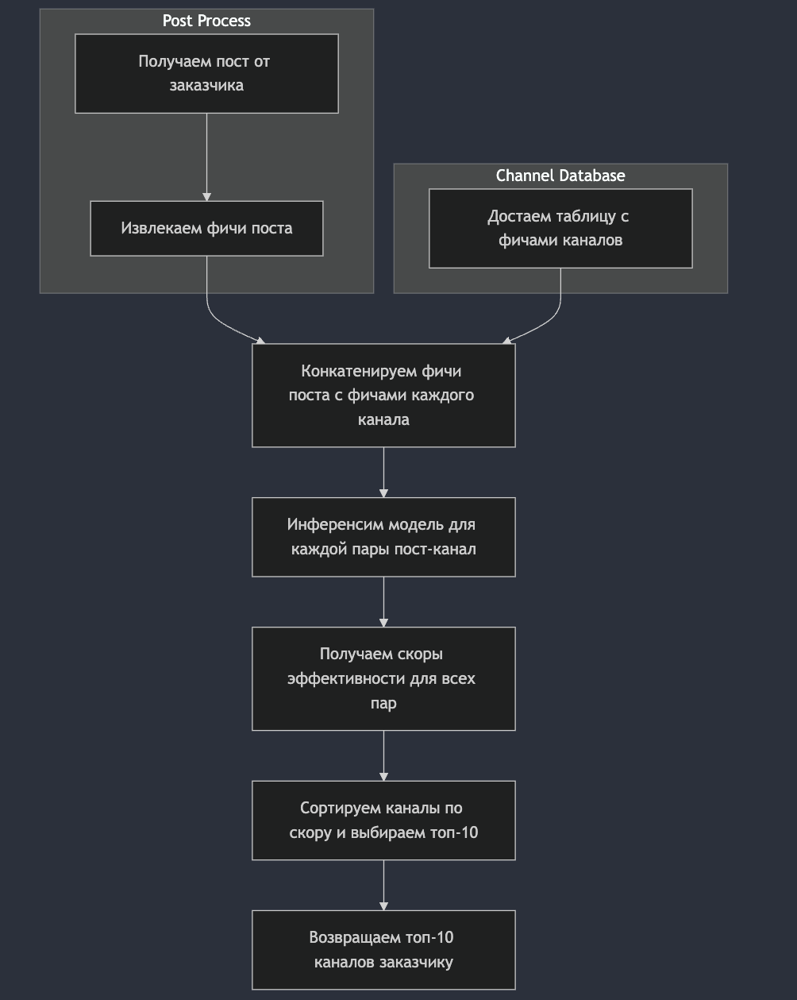

# ML System Design Doc - Targeting Solution for Telegram MVP v1.0

## 1. Цели и предпосылки 

### 1.1. Зачем идем в разработку продукта?  

- **Бизнес-цель**: Создание ML-решения для автоматизированного подбора Telegram-каналов для размещения рекламы, минимизируя зависимость от таргетологов.  
- **Почему станет лучше**:  
  - Рекламодатели смогут быстро находить наиболее релевантные каналы.  
  - Прогнозирование эффективности рекламы без привлечения таргетологов.  
  - Уменьшение времени и ресурсов на выбор площадок.  
- **Что будем считать успехом итерации**:  
  - Минимум 2 из 20 рекламодателей (из кастдев-группы) готовы запустить рекламу в предложенном канале.

### 1.2. Бизнес-требования и ограничения  

- **Бизнес-требования**:  
  1. Учитывать тематику поста и ограничения, указанные автором, при подборе канала.  
  2. Предоставлять прогноз по количеству просмотров рекламы в предложенных каналах.  

- **Что ожидаем от итерации**:  
  1. Создание базовой модели ранжирования для подбора каналов для размещения постов.  
  2. Тестирование результатов модели на пользователях из группы, участвующей в кастдеве.  

- **Бизнес-процесс пилота**:  
  1. Рекламодатель предоставляет рекламное объявление, которое он хочет разместить.  
  2. Мы возвращаем топ-10 наиболее подходящих каналов для размещения рекламы.  

- **Критерий успеха пилота**:  
  1. Минимум 10% тестовых пользователей соглашаются разместить рекламу в предложенном канале.

### 1.3. Что входит в скоуп проекта/итерации, что не входит   

- **Входит**:  
  1. Сбор данных для обучения и инференса модели через Telegram API.  
  2. Разработка базовой ранжирующей модели.  
  3. Построение API для инференса модели.  

- **Не входит**:  
  1. Разработка интерфейса для запуска на полном объеме клиентов.  
  2. Поддержка мультиплатформенности (выход за рамки Telegram).  

### 1.4. Предпосылки решения  

- Основные данные будут получены через Telegram API, включая метаинформацию о каналах и постах.  
- Горизонт прогноза: ориентировочно 2 дня (уточняется).  
- Будем учитывать тематику поста, авторские ограничения и текущую активность аудитории каналов.  

## 2. Методология  

### 2.1. Постановка задачи  

- Построение ранжирующей модели для рекомендаций Telegram-каналов, подходящих для размещения рекламы.  

### 2.2. Блок-схема решения  

  

### 2.3. Этапы решения задачи  

#### Этап 1: Подготовка данных  
- Сбор данных о постах, каналах, просмотрах и тематиках через Telegram API.  
- Обработка данных для создания витрин.  

| Название данных  | Источник данных               | Ресурс для получения данных | Проверено ли качество данных |
|-------------------|-------------------------------|-----------------------------|------------------------------|
| Посты и метрики   | Telegram API                 | Backend Engineer, Data Scientist | Нет                          |
| Метаданные каналов| Telegram API                 | Backend Engineer            | Нет                          |

#### Этап 2: Разработка модели  
- Выбор и настройка базового алгоритма ранжирования (например, CatBoost, LightGBM).  
- Определение метрик качества, связанных с бизнес-результатами: Precision@10, Recall, прогноз просмотров.  
- Горизонт прогноза и частота пересчета: уточняется.  

#### Этап 3: Построение API  
- Создание REST API для инференса модели: входной запрос — текст объявления, выход — топ-10 каналов.  
- Тестирование функционала API на ограниченной выборке данных.  

#### Этап 4: Тестирование пилота  
- Тестирование на кастдев-группе из 20 рекламодателей.  
- Оценка качества рекомендаций по бизнес-метрикам: минимум 10% участников готовы запустить рекламу.

## 3. Подготовка пилота  

### 3.1. Способ оценки пилота  

- Запуск пилотной модели на ограниченной кастдев-группе.  
- Сбор обратной связи от рекламодателей, включая их готовность запустить рекламу в предложенных каналах.  

### 3.2. Критерий успеха пилота  

- Успешным пилот считается, если хотя бы 10% тестовых пользователей готовы разместить рекламу в канале.  

### 3.3. Подготовка пилота  

- Прогнозируемая вычислительная сложность: оценить ресурсы для API-инференса модели на этапе тестирования.  

## 4. Внедрение (для production системы)  

### 4.1. Архитектура решения  

- Основные компоненты:  
  1. Сбор данных (Telegram API).  
  2. Инференс модели (сервер с REST API).  
  3. Обратная связь от пользователей (логирование и оценка).  

### 4.2. Риски  

- Качество данных из Telegram API может быть недостаточным.  
- Модель может предлагать нерелевантные каналы из-за ограниченности данных.  
- Технический долг: не оптимизированный интерфейс или API.  
